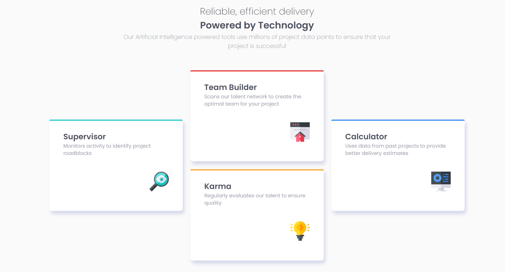
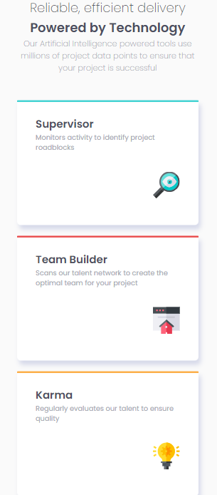

# Frontend Mentor - Four card feature section solution

This is a solution to the [Four card feature section challenge on Frontend Mentor](https://www.frontendmentor.io/challenges/four-card-feature-section-weK1eFYK). Frontend Mentor challenges help you improve your coding skills by building realistic projects. 

## Table of contents

- [Overview](#overview)
	- [Screenshot](#screenshot)
	- [Links](#links)
	- [Built with](#built-with)
- [Author](#author)

**Note: Delete this note and update the table of contents based on what sections you keep.**

## Overview

### The challenge

Users should be able to:

- View the optimal layout for the site depending on their device's screen size

### Screenshot

### Links

- Solution URL: [Add solution URL here](https://github.com/qahsishaq/four-card-feature-section-master)
- Live Site URL: [Add live site URL here](https://four-card-feature-section-master-pied-three.vercel.app/)

### Built with
- Semantic HTML5 markup
- Flexbox
## Author
- Frontend Mentor - [@qahsishaq](https://www.frontendmentor.io/profile/qahsishaq)
- Twitter - [@qahs_I_I_shaq](https://x.com/qahs_I_I_shaq)
